# 💬 Single-User Chat Application

[](LICENSE)
[](https://developer.mozilla.org/en-US/docs/Web/JavaScript)
[](https://developer.mozilla.org/en-US/docs/Web/CSS)
[](https://developer.mozilla.org/en-US/docs/Web/HTML)

A **single-user chat application** built with **HTML**, **CSS**, and **JavaScript** to practice **JavaScript DOM manipulation** and **localStorage**. This project showcases a variety of features, animations, and functionalities to create a seamless chat experience.

[](https://abdur-rahman-apu.github.io/Tweet-Tweet/)

## 🎬 Project Demo

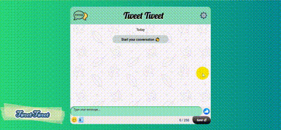
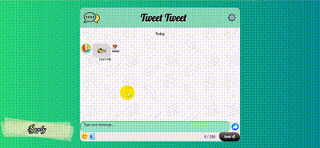
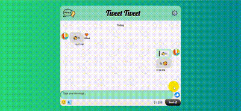
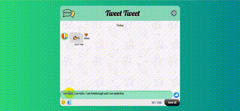
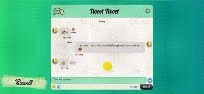

## 📑 Table of Contents

- [🚀 Features](#-features)
- [🛠️ Technologies Used](#-technologies-used)
- [📚 What I Learned](#-what-i-learned)
- [🏆 Challenges Overcome](#-challenges-overcome)
- [🧑‍💻 How to Use](#-how-to-use)
- [🔮 Future Improvements](#-future-improvements)
- [📸 Screenshots](#-screenshots)
- [📝 License](#-license)
- [📣 Acknowledgments](#-acknowledgments)
- [❓ FAQ](#-faq)
- [🤝 Contributing](#-contributing)
- [📞 Support](#-support)

## 🚀 Features

### 📨 Send, Reply, and Edit Messages

- **Send Messages** with a **250** character limit 📝
- Display **timestamp** for each message 🕒
- **Reply** to messages, showing the replied message above the input box ↩️
- **Edit** messages with an '**Edited**' flag ✏️
- **Navigate** to replied messages with a smooth highlight animation 🎯

### 👍 Reactions and Emojis

- **React** to messages with emojis 😍
- **Add/Remove** reactions
- **Format Text**: **Bold**, _Italic_, ~Strikethrough~, and <u>Underline</u> ✨
- **Send Emojis** and use the **like** emoji specifically ❤️

### 🗑️ Delete Messages

- **Delete** messages with a confirmation prompt ❌
- Confirmation message **"Message Deleted Successfully"** appears briefly ⏳
- Automatically disappears after a couple of seconds ⏳

### 🔍 Message Search

- **Real-time Search** with highlighted matches 🔦
- Display the **number of matches** 📊
- **Navigate** through results with up/down arrows 🔼🔽

### 👤 Profile & Customization

- **Change Profile Picture** by entering a valid image URL 🖼️
  - **URL Validation** with error messages ❗
  - **Preview** before saving 🔍
- **Customize Chat Background** for a personalized experience 🎨

### 🎨 Animations and UI Enhancements

- **CSS Animations** for smooth transitions and highlights ✨
- Highlight replied and edited messages with subtle animations 🌟

### 👋 Greeting and Wave Emoji

- Display a friendly "Start your conversation 👋" when there are no messages today 🌅
- Clicking the wave sends the 👋 emoji automatically 🎉

## 🛠️ Technologies Used

- **HTML5** 📄 - Structure
- **CSS3** 🎨 - Styling and Animations
- **JavaScript** 🖥️ - Functionality and DOM Manipulation
- **localStorage** 💾 - Data Persistence

## 📚 What I Learned

- **scrollIntoView** for smooth navigation to specific messages 🔄
- Using the `<mark>` tag for **text highlighting** 🖍️
- Handling **invalid image links** with validation and preview functionality 🚫🖼️
- Leveraging the **select event** and its `selectionStart` & `selectionEnd` properties for text formatting 📝
- Understanding the **true length of emojis** in JavaScript strings 😊🔢
- Managing and updating **complex data structures** in **localStorage** 📂
- Mastering **CSS specificity** and the importance of the **z-index** property with positioning 📏

## 🏆 Challenges Overcome

- **Smooth Navigation**: Implemented `scrollIntoView` and background animations for message highlights 🚀
- **Search Box Positioning**: Adjusted the message container height to fix the search bar 📐
- **Character Counting for Emojis**: Converted strings to arrays to accurately count characters with emojis 🔢➡️📋
- **Text Formatting**: Utilized the `select` event and its properties to enable text styling options like bold and italic ✒️

## 🧑‍💻 How to Use

1. **Clone the Repository**:
   ```bash
   git clone https://github.com/Abdur-Rahman-Apu/Tweet-Tweet.git
   cd Tweet-Tweet
   ```
2. **Open the Application**:
   - Open `index.html` in your preferred web browser to start using the chat app 🌐

## 🔮 Future Improvements

- [ ] **Multi-User Functionality** 👥
- [ ] **Advanced Emoji Reactions** 😎
- [ ] **Database Integration** for long-term message storage 🗄️
- [ ] **Mobile Responsiveness** 📱
- [ ] **Dark Mode** 🌙

## 📸 Screenshots

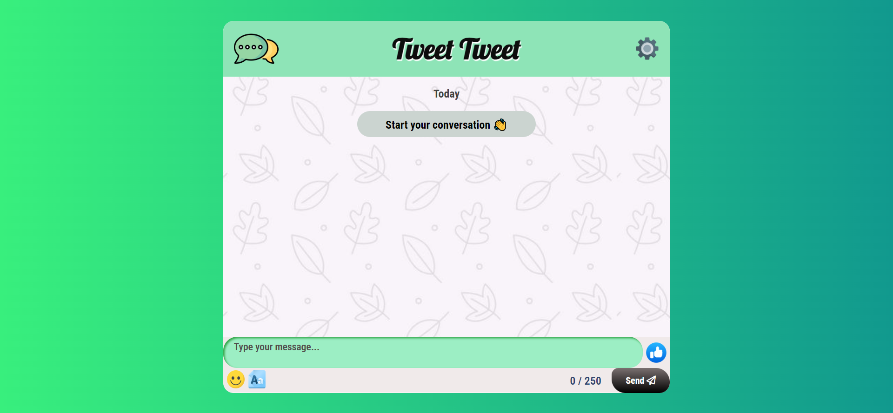
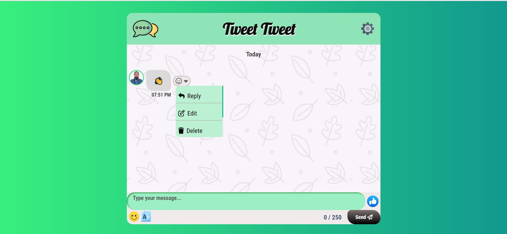
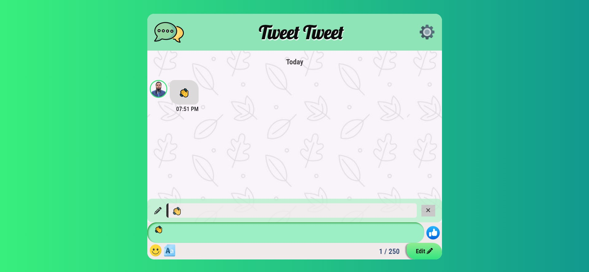
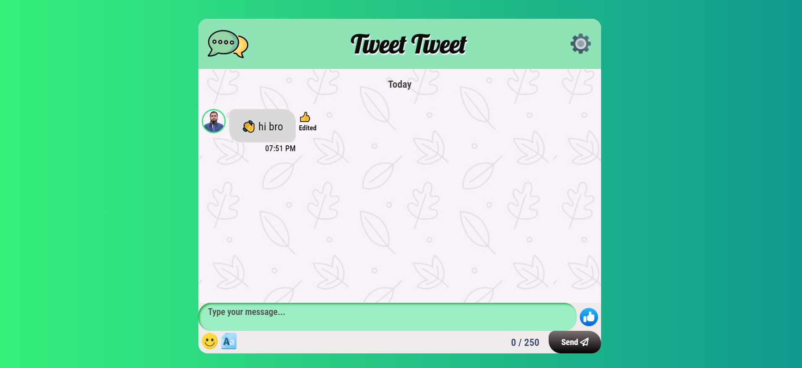
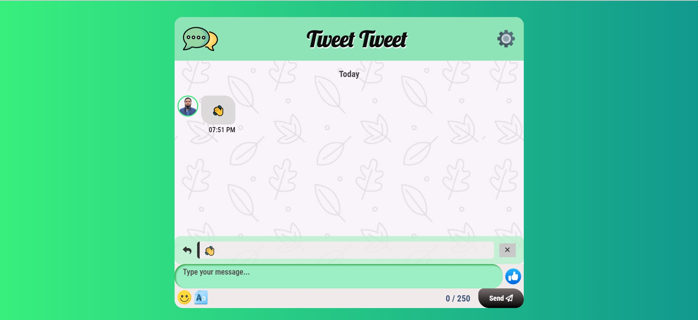

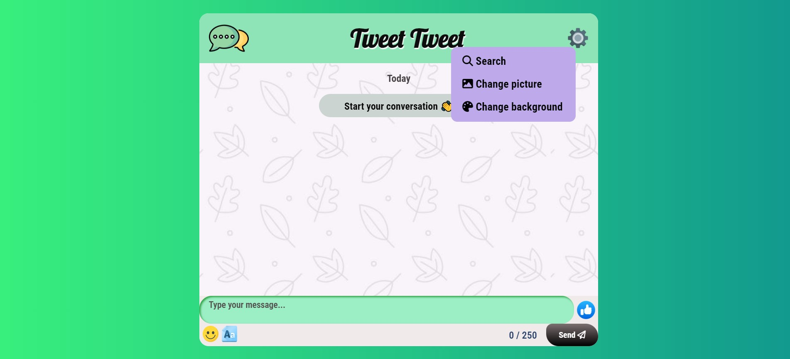
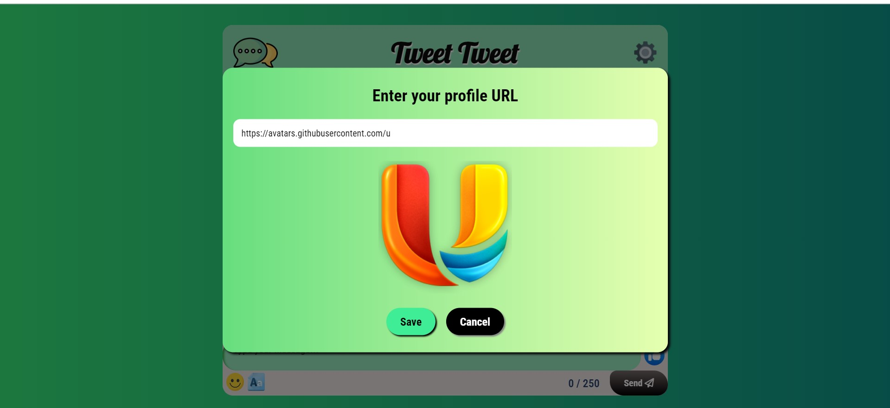

## 📝 License

This project is licensed under the [MIT License](LICENSE) © 2024.

## 📣 Acknowledgments

- [Font Awesome](https://fontawesome.com/) for icons
- [Unsplash](https://unsplash.com/) for images
- [JavaScript Info](https://javascript.info/) for learning resources
- Special thanks to [JavaScript Ninja](https://webdeveloperbd.net/js-bootcamp/) for their guidance

## ❓ FAQ

**Q: Can I use this app on mobile devices?**  
A: Yes, the app is responsive and works on most modern mobile browsers.

**Q: How is my data stored?**  
A: Messages are stored locally in your browser's `localStorage`.

**Q: How can I reset my chat history?**  
A: Clear your browser's localStorage or use the reset option in the app settings.

## 📞 Support

If you encounter any issues or have questions, feel free to [open an issue](https://github.com/yourusername/chat-app/issues) on GitHub or contact me at [abdurrahmany418@gmail.com](mailto:abdurrahmany418@gmail.com)

---

&copy; 2024 Abdur Rahman Apu. All rights reserved.
